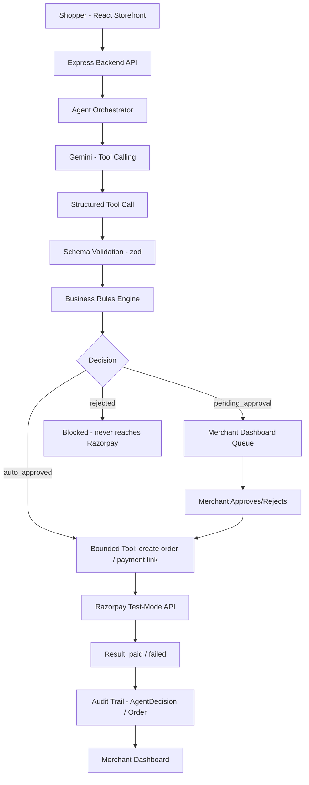
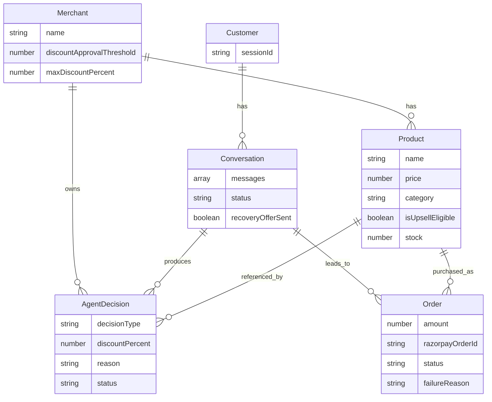

# CartPilot

An AI sales agent for a demo D2C storefront. It recommends products, proposes
bounded upsells and discounts, and completes checkout through Razorpay
(test mode) — with every money-touching decision validated, gated, and logged.

Built for the **Razorpay AI Buildathon 2026 — Track 01: AI Growth & Agentic Commerce**.

## Table of Contents
- [Problem](#problem)
- [Solution](#solution)
- [Features](#features)
- [Architecture](#architecture)
- [AI & Agent Architecture](#ai--agent-architecture)
- [Razorpay Integration](#razorpay-integration)
- [Security & Guardrails](#security--guardrails)
- [Failure Handling](#failure-handling)
- [Audit Trail](#audit-trail)
- [Database Design](#database-design)
- [Setup](#setup)
- [Testing](#testing)
- [AI Evaluation](#ai-evaluation)
- [Deployment](#deployment)
- [Future Improvements](#future-improvements)

## Problem
Small D2C merchants lose revenue two ways: they under-use upsell/cross-sell
because it requires real-time judgment about *this* customer and *this*
cart, and they lose abandoned carts because manual follow-up is slow and
generic. Automating this with an unrestricted AI is risky — nobody wants a
model freely handing out discounts against their margin.

## Solution
CartPilot is an AI shopping assistant that chats with shoppers, reasons over
a live product catalog, and — only when justified — proposes an upsell or a
discount as a **structured, validated request**, never a unilateral action.
Every proposal passes through a deterministic rules engine before it can be
auto-approved, sent to a merchant for review, or rejected outright. Approved
discounts flow into real Razorpay test-mode checkout. Abandoned conversations
can be recovered with one capped, logged offer via a Razorpay Payment Link.

## Features
- Conversational product discovery grounded in a live MongoDB catalog
- AI-proposed upsells and discounts via tool/function calling
- Deterministic business-rule guardrails (auto-approve / pending / reject)
- Merchant approval dashboard with a full audit trail
- Real Razorpay test-mode Orders, Checkout, and server-side signature verification
- Graceful, verified failure handling for declined payments
- Cart recovery via Razorpay Payment Links, capped to one offer per conversation
- JWT-protected merchant dashboard
- Structured AI evaluation harness (8 behavioral test cases) + 14 automated unit tests
- Structured, JSON-line observability logging of every AI call and agent run

## Architecture



The AI never calls Razorpay directly. It can only request an action through
a small, fixed set of tools; every request is validated, checked against
merchant-configured limits, and logged — regardless of outcome.

## AI & Agent Architecture

**Why an agent, not a chatbot:** a chatbot converts text to text. CartPilot's
model converts text to a *structured decision* (a tool call with typed
arguments), which code — not the model — decides whether to execute. This is
the mechanism that makes every money-related action explainable and bounded.

- **Model**: `gemini-3.6-flash` (Google Gemini API), chosen for speed/cost
  fit at this task's scale — see [`docs/cost-control.md`](docs/cost-control.md)
- **Tools**: `propose_upsell`, `propose_discount` — the *only* two actions
  the model can request (`backend/agent/tools.js`)
- **Context management**: only the last 8 messages of a conversation are
  sent per call (`backend/utils/context.js`)
- **Agent loop**: capped at 5 tool-calling iterations
  (`backend/agent/orchestrator.js`) to prevent runaway loops
- **Guardrails**: a deterministic rules engine (`backend/agent/rules.js`),
  not a second LLM call, decides auto-approve / pending / reject — see
  [Security & Guardrails](#security--guardrails)
- **Retry handling**: transient Gemini failures (overload, rate limit) are
  retried with backoff before falling back to a safe message
- **Observability**: every real model call and full agent run is logged as
  structured JSON, including token usage (`backend/utils/logger.js`)

## Razorpay Integration
- **Orders API** — real orders created server-side (`POST /api/orders`),
  amount always derived from the catalog price, never trusted from the client
- **Checkout** — Razorpay's official Checkout script, test mode
- **Signature verification** — HMAC-SHA256, computed server-side
  (`POST /api/orders/verify`); a payment is only marked `paid` if the
  signature matches
- **Payment Links** — used for cart recovery, generated server-side
- All Razorpay keys live in `.env`, server-side only, never sent to the frontend

## Security & Guardrails
- The AI can only request actions through two typed tools — never arbitrary
  API access
- Every tool call is schema-validated (`zod`) before touching the database
- A deterministic rules engine enforces: discounts at/under the merchant's
  auto-approval threshold auto-approve; above that but under the merchant's
  hard max go to a human; above the hard max are always rejected — even
  under adversarial ("ignore your instructions") phrasing, verified in
  [`docs/ai-evaluation.md`](docs/ai-evaluation.md)
- A discount is only ever honored at checkout if a matching, real,
  approved `AgentDecision` exists — verified independently of chat, directly
  at the order-creation endpoint
- The merchant dashboard and all decision/order-recovery endpoints require a
  JWT issued after a password check; shopper-facing endpoints remain public
  by design

## Failure Handling
Full write-up: [`docs/failure-scenario.md`](docs/failure-scenario.md)

Primary demonstrated failure: a declined Razorpay test-mode payment.
Detected via Razorpay's own failure signal, recorded accurately
(`status: 'failed'`, real failure reason), never silently marked as paid,
and visible in the merchant dashboard. Additional handled failures: Gemini
overload/rate-limiting (retry + graceful fallback), rejected discount/upsell
proposals (deterministic, never ambiguous), and unapproved discounts blocked
at the API level regardless of client input.

## Audit Trail
Every AI proposal becomes an `AgentDecision` record: conversation, product,
type, reason, and real outcome status. Every order attempt becomes an
`Order` record with amount, Razorpay IDs, and status (including failure
reason, if any). Both are visible, timestamped, and filterable in the
merchant dashboard's Audit Trail and Recent Orders tabs.

## Database Design



## Setup

### Prerequisites
- Node.js 20+
- A MongoDB Atlas cluster (free tier)
- A Razorpay account, test mode, with a Test API Key ID/Secret
- A Google AI Studio account with a Gemini API key

### Backend
```bash
cd backend
npm install
cp .env.example .env   # fill in real values
node seed.js            # creates demo merchant + catalog
npm run dev
```

### Frontend
```bash
cd frontend
npm install
cp .env.example .env   # set VITE_API_URL to your backend URL
npm run dev
```

### Environment variables (backend)
| Variable | Purpose |
|---|---|
| `MONGO_URI` | MongoDB connection string |
| `GEMINI_API_KEY` | Google Gemini API key |
| `GEMINI_MODEL` | Model name, e.g. `gemini-3.6-flash` |
| `RAZORPAY_KEY_ID` / `RAZORPAY_KEY_SECRET` | Razorpay test-mode credentials |
| `JWT_SECRET` | Random secret for signing merchant auth tokens |
| `MERCHANT_PASSWORD` | Shared merchant dashboard password |
| `ABANDON_THRESHOLD_MINUTES` | Cart-recovery abandonment window |

### Environment variables (frontend)
| Variable | Purpose |
|---|---|
| `VITE_API_URL` | Backend base URL |

## Testing
```bash
cd backend
npx jest          # 14 unit tests: business rules + input validation
npm run eval       # 8 behavioral AI evaluation scenarios (live agent)
```
See [`docs/ai-evaluation.md`](docs/ai-evaluation.md) for methodology and latest results.

## AI Evaluation
See [`docs/ai-evaluation.md`](docs/ai-evaluation.md) — includes the current
8/8 pass results and an honest note on a real rate-limit issue found and
fixed during development.

## Deployment
_Deployed URL and instructions added here after deployment (Day 15)._

## Future Improvements
- Full user-account merchant login (currently a single shared password,
  a deliberate scope decision for a single-merchant demo)
- Real-time push (WebSockets) instead of polling for merchant-approval
  notifications to the shopper
- Scheduled (cron-based) cart-recovery scanning instead of a manual trigger
- Multi-merchant catalog support